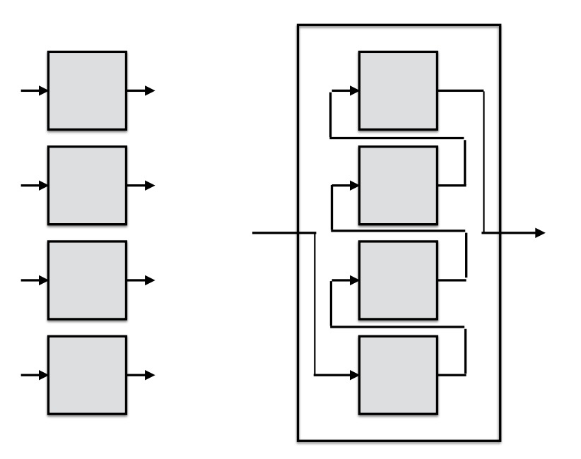

Magma circuit instances are very similar to functions in a programming language.
Each circuit instance has a interface similar to a function signature.
Many programming languages provide higher-order functions.
Higher-order functions take as arguments functions and return new functions.
Magma has a similar concept: higher-order circuit functions.
Higher-order circuit functions take as arguments circuit instances and return new circuit instances.

One complexity with circuits is that they need not be functional.
In particular, circuits flip-flops and registers contain state.
Thus, they may not obey the semantics of function composition.
Magma generalizes many common functional programming design patterns
by providing wiring primitives.
The most powerful higher-order primitive in Magma is `braid`,
which wires circuits together in a general way.
With this function it is possible to create systolic circuits.

### Compose

Create a new circuit by composing `g` with `h`.
This has the effect of wiring `h`'s outputs to `g`'s inputs.
```python
f = compose(g, h)
```

### Curry and Uncurry

The curry function takes a circuit `g` 
and breaks apart an input argument array into separate input arguments for each element of the array.
The argument chosen to be split apart is given by `prefix`.
```python
f = curry(g, prefix='I')
```

Suppose we have a circuit like a `ROM`
```python
# ROM2 :: I:In(Bits(2)), O:Out(Bit)
```
then
```python
# LUT2 :: I0:In(Bit), I1:In(Bit), Out(Bit)
LUT2 = curry(ROM2) 
```

The reverse of `curry` is `uncurry`.
The `uncurry` function takes a circuit `g` 
and combines all the input arguments beginning with `prefix`
into a single input argument named `prefix`.
All these arguments must have the same type.
```python
f = curry(g, prefix='I')
```
Applying `uncurry` to `LUT2` returns `ROM2`.
```python
ROM2 = curry(LUT2) 
```

### Join, Flat, and Fork

The `join` functions takes a list of n circuits
with the same interface.
A new circuit is returned with inputs and outputs
which are combined into array of length equal to the number of circuits.

```python
f = join([fs])
```


The classic example of join is to form a register.
First, we start with a `DFF`
```python
# DFF :: I:In(Bit), O(Bit)
dff = DFF()
```
```python
# reg :: I:In(Bits(8)), O(Bits(n))
reg = join(FFs(8))
```
`FFs(n)` returns n `DFF`s in a list.

The `flat` function is similar to `join`.
The difference is in `flat` each argument is interpreted to be an array,
and all the elements of these arrays are flattened into a single array.

The `fork` functions takes a list of n circuits
with the same interface.


A new circuit is returned with the inputs *forked* and outputs joined.
Forking an input means that the same value is wired up to all the inputs.

### Fold and Scan

 
The basic idea of a fold is to wire up an output from
one circuit to the input of the next circuit.
In particular, given a list of circuits,
the output from circuit i-1 is wired to the input of circuit i.



The classic example of a fold is a serial-in, serial-out (SISO) shift register.
```python
# SISO :: I:In(Bit), O:Out(Bit))
SISO = fold(FFs(8), foldargs={'I':'O'})
```
Note that the fold is specified with a dictionary.
The key is an input and its value is the output connected to it.
The dictionary `{'I':'O'}` says to wire `O` to `I`.
Note that the first input from circuit 0,
and the last output from circuit n-1, are retained in the resulting circuit.

Scan is simular to fold.
The difference is that all the intermediate outputs are preserved.


The classic example of a scan is a serial-in parallel-out (SIPO) shift register.
```python
# SIPO :: I:In(Bit), O:Out(Bits(8)))
SISO = fold(FFs(8), foldargs={'I':'O'})
```
Note that the scan is specified with a dictionary in the same was as the fold.
Note that the first input from circuit 0 is retained,
and the all the outputs from the circuits are joined.

### Braid

Braid is a powerful generalization of all these methods.
Since each higher-order circuit function specifies a certain type of wiring pattern,
multiple patterns can be combined.
The names of the arguments are passed into braid,
and a wiring function is applied to those operators.
The general form is
```python
#
#  forkargs : list of argument names to fork
#  joinargs : list of argument names to join
#  flatargs : list of argument names to flatten
#  foldargs : dict of argument namein:nameout, set namein[i+1] to namout[u]
#  rfoldargs : dict of argument namein:nameout, set namein[i-1] to namout[u]
#  scanargs : dict of argument namein:nameout, set namein[i+1] to namout[u]
#  rscanargs : dict of argument namein:nameout, set namein[i-1] to namout[u]
#
# by default, clock arguments are forked, unless they appear in another keyword
# by default, any arguments not appearing in a keyword are joined
# 
# Note that we can also perform rightward folds and scans. In a rightward fold
# and scan argument i+1 is wired to argument i.
#
braid( [fs],forkargs=[],
            joinargs=[],
            flatargs=[],
            foldargs={}, rfoldargs={},
            scanargs={}, rscanargs={}):
```

A good example of `braid` is the above register example,
```python
reg = braid(FFs(8), forkargs='CLK', joinargs=['I', 'O'])
```
The input `I` and output `O` are joined,
and the clock `CLK` is forked.

### Utilities

These utilities call the function f n times to create a list of circuits.
```python
row(f, n)
col(f, n)
map_(f, n)
```
In `row` and `col`, the function `f` is passed the position in the sequence as an argument
(meant to be its x and y location).
